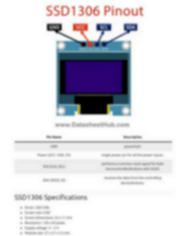

# ESP32_DHT22_WEBSERVER
##### mit CallMeBot API
##### Vorlage: https://randomnerdtutorials.com/esp32-web-server-gauges/

## Beschreibung
In diesem Projekt wird ein Webserver mit einem [ESP32](https://www.jf-elektronik.de/produkt/esp32-development-board-usb-c/) über WiFi realisiert. Als Vorlage wurde hier das [Random Nerd Tutorial](https://randomnerdtutorials.com/esp32-web-server-gauges/) Projekt gewählt. Dieses wurde um zwei Erweiterungen ergänzt. Erstens die Zeitausgabe die mit einem [SSD1306 128x64 I2C Display](https://www.az-delivery.de/products/0-96zolldisplay) dargestellt wird und zweitens das versenden einer Nachricht auf Telegram oder WhatsApp mit der [CallMeBot](https://www.callmebot.com/) API wenn der ESP32 sich mit dem WLAN verbindet.
## Komponenten
    Hardware:
        ESP32
        DHT22
        SSD1306 Display
        4.7kΩ Wiederstand
        Verbindungskabel
    Software:
        IDE VSCode oder Arduino
        CallMeBot API
  
## Pinbelegung
    DHT22:
        DATA = D5 + 3V3(4.7K Ohm)
        VCC = 3V3
        GND = GND
    SSD1306:
        SCL = D21
        SDA = D22
        VCC = 3V3
        GND = GND
## Schaltplan
Bilder folgen ...
## Sourcecode
    /*
    Hardware Komponenten:
      ESP-WROOM-32
      SSD1306 Display
      DHT22
      Verbindungskabel
    Software Komponenten:
      IDE = VSCODE mit Platformio
      CallMeBot API
    */

    /*
    Genutzte Vorlage:
      https://randomnerdtutorials.com/esp32-web-server-gauges/
    CallMeBot:
      https://www.callmebot.com/blog/telegram-text-messages/
      https://www.callmebot.com/blog/whatsapp-messages-from-esp8266-esp32/
    */

    /*Bibliotheken*/
    #include <Arduino.h>
    #include <WiFi.h>
    #include <AsyncTCP.h>
    #include <ESPAsyncWebServer.h>
    #include "SPIFFS.h"
    #include <Arduino_JSON.h>
    #include <Wire.h>
    #include <Adafruit_GFX.h>
    #include <Adafruit_SSD1306.h>
    #include <WiFiUdp.h>
    #include <NTPClient.h>
    #include <DHTesp.h>
    #include <HTTPClient.h>
    #include <UrlEncode.h>

    /*Initialisierung des SSD1306 Display*/
    #define SCREEN_WIDTH 128 // OLED display width, in pixels
    #define SCREEN_HEIGHT 64 // OLED display height, in pixels
    #define OLED_RESET     -1 // Reset pin # (or -1 if sharing Arduino reset pin)
    #define SCREEN_ADDRESS 0x3C ///< See datasheet for Address; 0x3D for 128x64, 0x3C for 128x32
    Adafruit_SSD1306 oled(SCREEN_WIDTH, SCREEN_HEIGHT, &Wire, OLED_RESET);

    /*Ändern für WLAN Name und Passwort*/
    const char* ssid = "YOUR_SSID";
    const char* password = "SSID_PASSWORD";

    /*CallMeBot Verifikationsdaten für WhatsApp*/
    const String phoneNumber = "YOUR_PHONENUMBER";
    const String apiKey = "CALLMEBOT_API_KEY";

    char wochentage[7][12] = {"So","Mo", "Di", "Mi", "Do", "Fr", "Sa"};

    /*Timer Variablen*/
    unsigned long lastTime = 0;
    unsigned long timerDelay = 10000;

    /*Objekt Erstellung*/
    WiFiUDP ntpUDP;
    NTPClient timeClient(ntpUDP, "pool.ntp.org");
    DHTesp dht;
    HTTPClient http;
    WiFiClient client;
    AsyncWebServer server(80);
    AsyncEventSource events("/events");
    JSONVar readings;

    /*
    Methode sendMessage():
      CallMeBot(WhatsApp / Telegram) Konfiguration
    */ 
    void sendMessage (String message){
      // Daten die zur Verifikation gesendet werden
      String whatsapp = "http://api.callmebot.com/whatsapp.php?phone=" + phoneNumber + "&apikey=" + apiKey + "&text=" + urlEncode(message);
      String telegram = "http://api.callmebot.com/text.php?user=[@YOUR_TELEGRAM_ACCOUNT_NAME]&text=" + urlEncode(message) + "&html=no&links=no";
      http.begin(client, telegram);
      // http.begin(client, whatsapp);

      // Header
      http.addHeader("Content-Type", "application/x-www-form-urlencoded");

      // HTTP Post request senden
      int httpResponseCode = http.POST(telegram); // Hier telegram oder whatsapp auswählen für Endpunkt
      if (httpResponseCode == 200) {
        Serial.print("Message sent successfully");
      } else {
        Serial.println("Error sending the message");
        Serial.print("HTTP response code: ");
        Serial.println(httpResponseCode);
      }

      http.end();
    }

    // Get Sensor Readings and return JSON object
    String getSensorReadings(){
      readings["humidity"] = String(dht.getHumidity()); 
      readings["temperature"] = String(dht.getTemperature());
      String jsonString = JSON.stringify(readings);
      return jsonString;
    }

    /*Ausgabe für SSD1306 Display*/ 
    void localResponse(){
       float hum = dht.getHumidity();
       float tmp = dht.getTemperature();
    
       if (isnan(hum)||isnan(tmp)){         // Abfrage ob DHT22 Sensordaten gelesen werden können
        Serial.print("Keine Sensorwerte");  // Serial Monitor Ausgabe wenn keine DHT22 Sensordaten verfügbar sind
       } else {                             // Wenn Sensordaten vorhanden Ausgabe über SSD1306 Display
         oled.setTextSize(0);

         oled.setCursor(0,45);
         oled.print("Temp: ");
         oled.setCursor(35,45);
         oled.print(tmp);
         oled.print(" C");

         oled.setCursor(0,55);
         oled.print("Hum: ");
         oled.setCursor(35,55);
         oled.print(hum);
         oled.print(" %");

         oled.display();
         }

       }

    void ntpTimer(){
      // Deklarierung der Ganz Zahl Variablen für Tag, Stunde, Minute, Sekunde
      int aktuellerTag = timeClient.getDay();
      int aktuelleStunde = timeClient.getHours();
      int aktuelleMinute = timeClient.getMinutes();
      int aktuelleSekunde = timeClient.getSeconds();

      String formattedTime = timeClient.getFormattedTime();

      int middle_string = ((6 * formattedTime.length()));

      timeClient.update();

      char timestamp[20];
      sprintf(timestamp, "%s, %2d:%2d:%2d", wochentage[aktuellerTag], aktuelleStunde, aktuelleMinute, aktuelleSekunde);
    
      oled.clearDisplay();
      oled.setTextSize(2);
      oled.setTextColor(SSD1306_WHITE);
      oled.setCursor(((SCREEN_WIDTH / 2) + ( - (middle_string))), ((SCREEN_HEIGHT / 2) / 2));
      oled.print(formattedTime);
      oled.setTextSize(1);
      oled.setCursor(0,0);
      oled.print(wochentage[aktuellerTag]);

      oled.setTextSize(1);
      oled.setCursor(0,45);
      oled.print("");

      // Aufruf der Methode localResponse()
      localResponse();

      oled.display();
    }

    /*
    Methode initSPIFFS():
      Initialisierung SPIFFS = Serial Peripheral Interface Flash File System
    */
    void initSPIFFS() {
      if (!SPIFFS.begin()) {
        Serial.println("An error has occurred while mounting SPIFFS");
      }
      Serial.println("SPIFFS mounted successfully");
    }

    /*
    Methode initWiFi():
      Ausgabe über SSD1306 Display bei Verbindung
      Initialisierung WiFi
      Wenn WiFi Verbunden ist dann senden der Nachricht über Telegram oder Whatsapp
    */ 
    void initWiFi() {
      oled.clearDisplay();
      oled.setTextSize(1);
      oled.setTextColor(SSD1306_WHITE);
      oled.setCursor(0,0);
      oled.print("Verbindet mit SSID");
      oled.setCursor(64 ,20);
      oled.print(ssid);
      oled.display();

      WiFi.mode(WIFI_STA);
      WiFi.begin(ssid, password);
      Serial.print("Verbindet mit WiFi ...");
      while (WiFi.status() != WL_CONNECTED) {
        Serial.print('.');
        delay(1000);
      }

      if (WiFi.status() == WL_CONNECTED){
        sendMessage("ESP32 /" + WiFi.localIP().toString() + " ist Online"); // Die Nachricht die gesendet wird wenn der ESP32 sich mit dem WLAN verbindet.
       }

      oled.clearDisplay();
      oled.setTextSize(1);
      oled.setTextColor(SSD1306_WHITE);
      oled.setCursor(0,0);
      oled.print("Server gestartet");
      oled.setCursor(0,20);
      oled.print("IP-Adresse");
      oled.setCursor(0,30);
      oled.print(WiFi.localIP().toString());
      oled.display();
      delay(10000); // 10 sek
      oled.clearDisplay();
    
      Serial.println(WiFi.localIP());
    }

    void setup() {

      // SSD1306 Display
      if (!oled.begin(SSD1306_SWITCHCAPVCC, 0x3C)){
        Serial.println(F("SSD1306 allocation failed"));
        for(;;);
      }
    
      Serial.begin(115200);
      initWiFi();
      initSPIFFS();
      timeClient.begin();
      timeClient.setTimeOffset(7200);
      dht.setup(5, DHTesp::DHT22);

      // Web Server Root URL
      server.on("/", HTTP_GET, {
        request->send(SPIFFS, "/index.html", "text/html");
      });

      server.serveStatic("/", SPIFFS, "/");

      // Request for the latest sensor readings
      server.on("/readings", HTTP_GET, {
        String json = getSensorReadings();
        request->send(200, "application/json", json);
        json = String();
      });

      events.onConnect({
        if(client->lastId()){
          Serial.printf("Client reconnected! Last message ID that it got is: %u\n", client->lastId());
        }
        // send event with message "hello!", id current millis
        // and set reconnect delay to 1 second
        client->send("hello!", NULL, millis(), 10000);
      });
      server.addHandler(&events);

      // Start server
      server.begin();
    }

    void loop() {
      if ((millis() - lastTime) > timerDelay) {
        // Send Events to the client with the Sensor Readings Every 10 seconds
        events.send("ping",NULL,millis());
        events.send(getSensorReadings().c_str(),"new_readings" ,millis());
        lastTime = millis();
      }
      if(WiFi.status() == WL_CONNECTED){
        ntpTimer();
      } 
    }
## Erklärung zum Sourcecode
Da es sich hier um eine erweiterte Vorlage handelt würde ich zur genauen Beschreibung auf [Random Nerd Tutorial](https://randomnerdtutorials.com/esp32-web-server-gauges/) verweisen. Die Erklärung die hier folgt beinhaltet nur meinen erweiterten Sourcecode.
